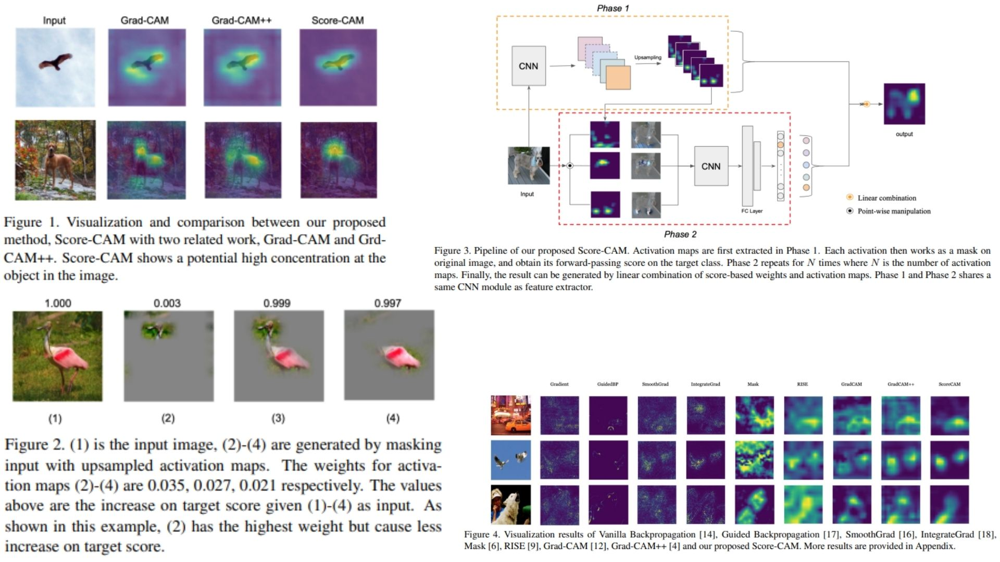

# 🖼️ ScoreCAM-Replication — Score-Weighted Class Activation Mapping

This repository provides a **faithful Python replication** of the **Score-CAM framework** for visual explanation of CNN predictions.  
The code implements the pipeline described in the original paper, including **activation map extraction, input masking, forward scoring, and heatmap generation**.

Paper reference: *[Score-CAM: Score-Weighted Visual Explanations for CNNs](https://arxiv.org/abs/1910.01279)*  

---

## Overview 🎨



> The pipeline extracts **activation maps** from a selected convolutional layer, **upsamples** them to the input size, generates **masked inputs**, computes **class scores**, and produces a **weighted heatmap** using the Score-CAM algorithm.

Key points:

* **CNN backbone**: produces feature maps $$A_k$$ at target layer  
* **Upsampling**: $$\tilde{A}_k = \text{Upsample}(A_k)$$ to input size  
* **Normalization**: $$\hat{A}_k = \frac{\tilde{A}_k - \min(\tilde{A}_k)}{\max(\tilde{A}_k) - \min(\tilde{A}_k)}$$  
* **Masked inputs**: $$X_k = X \odot \hat{A}_k$$  
* **Forward pass score**: $$f_c(X_k)$$ for target class $$c$$  
* **Weight normalization**: $$\alpha_k = \frac{\exp(f_c(X_k))}{\sum_i \exp(f_c(X_i))}$$  
* **Heatmap generation**: $$L_\text{Score-CAM} = \text{ReLU}\Big(\sum_k \alpha_k \cdot A_k \Big)$$  

---

## Core Math 📐

**Activation extraction**:

$$
A_k = \text{ActivationExtractor}(X)
$$

**Upsample & normalize**:

$$
\tilde{A}_k = \text{Upsample}(A_k), \quad
\hat{A}_k = \frac{\tilde{A}_k - \min(\tilde{A}_k)}{\max(\tilde{A}_k) - \min(\tilde{A}_k)}
$$

**Masked input generation**:

$$
X_k = X \odot \hat{A}_k
$$

**Forward scoring**:

$$
f_c(X_k) = \text{ModelForward}(X_k)[c]
$$

**Weight normalization**:

$$
\alpha_k = \frac{\exp(f_c(X_k))}{\sum_i \exp(f_c(X_i))}
$$

**Final Score-CAM heatmap**:

$$
L_\text{Score-CAM} = \text{ReLU}\Big(\sum_k \alpha_k \cdot A_k \Big)
$$

---

## Why Score-CAM Matters 🌿

* Produces **class-discriminative visual explanations** without gradients 🧩  
* Avoids **gradient saturation issues** of Grad-CAM  
* Works with **any CNN backbone**, providing interpretable **heatmaps** for model predictions  

---

## Repository Structure 🏗️

```bash
ScoreCAM-Replication/
├── src/
│   ├── backbone/
│   │   ├── resnet_conv.py            # ResNet conv blocks (last conv layer: A_k)
│   │   ├── vgg_conv.py               # VGG conv blocks (feature extraction)
│   │   └── alexnet_conv.py           # Optional alternative backbone
│   │
│   ├── layers/
│   │   ├── activation_extractor.py   # Hook to get feature maps A_k
│   │   ├── upsampling.py             # Upsample A_k to input size
│   │   ├── normalization.py          # Min-max normalization
│   │   └── masking.py                # Generate masked input X_k = X ⊙ A_k
│   │
│   ├── scoring/
│   │   ├── forward_pass.py           # Forward pass of masked input → f_c(X_k)
│   │   └── score_normalization.py    # Softmax normalization → α_k
│   │
│   ├── cam/
│   │   └── score_cam.py              # Score-CAM: α_k * A_k → sum → ReLU
│   │
│   ├── model/
│   │   └── scorecam_model.py         # Backbone + full pipeline
│   │
│   └── config.py                    
│
├── images/
│   └── figmix.jpg
│
├── requirements.txt
└── README.md
```

---

## 🔗 Feedback

For questions or feedback, contact:  
[barkin.adiguzel@gmail.com](mailto:barkin.adiguzel@gmail.com)
